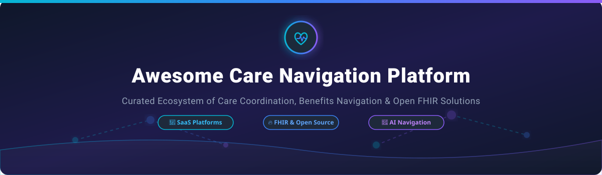

# Awesome Care Navigation Platform 🏥 🚀

  
  
  
  
  

## 🌟 Overview & Top Care Navigation Platforms Ecosystem

**Curated List of SaaS Products, Enterprise Healthcare Software & Open-Source GitHub Projects**

*Focused on Healthcare Provider Matching, Employee Benefits Navigation, Clinical Care Steerage, Virtual Care Coordination & AI Member Guidance.*

---

## 💡 Market Insights & Ecosystem Landscape

> **📊 Estimated Market Size:** The global Healthcare Navigation Platform market is valued at **$11 Billion – $15 Billion** (2025–2026) and is projected to reach **$22 Billion – $26 Billion by 2033**, growing at a CAGR of **~9.5%**.
> 
> **🔀 Market Dynamics:** The sector is **highly fragmented**, populated by enterprise digital health suites, specialty navigation startups, insurance payer platforms (e.g., Optum, Carelon), and EHR health systems. While major M&A activity is ongoing, no single vendor holds dominance across clinical advocacy, virtual care, and pharmacy benefits steerage.

---

## 🏢 SaaS & Hosted Commercial Platforms

Below is a comparative matrix of commercial healthcare care navigation platforms, ordered by **Company Scale (Annual Segment Revenue / Valuation)** in descending order:

| SaaS Platform 🏢 | Company Scale (Revenue / Valuation) 💰 | Starting Pricing Tier 🏷️ | Free Tier / Trial Limit ⏳ | Key Capabilities & Overview 🎯 |
| :--- | :--- | :--- | :--- | :--- |
| **[Carelon](https://www.carelon.com/)** | **~$53.9 Billion** Annual Segment Revenue | Contact Sales for Custom Enterprise Licensing | 14-Day Enterprise Guided Sandbox / Demo Available | Comprehensive healthcare delivery, pharmacy benefits, and care management platform. |
| **[Quantum Health](https://www.quantum-health.com/)** | **>$1.0 Billion** Annual Revenue | Custom Quote per Employee per Month (PEPM) | No Free Trial (Custom Interactive Demo On Request) | Healthcare navigation and care coordination platform for self-insured employers. |
| **[Transcarent](https://www.transcarent.com/)** | **$2.2 Billion** Valuation | Enterprise Contract based on Population Size & PEPM | No Free Trial (Live Platform Demonstration Available) | Comprehensive member front door combining virtual care, surgery center access, and navigation. |
| **[Included Health](https://includedhealth.com/)** | **$1.1 Billion** Valuation (~$344.8M Est. Revenue) | Custom Enterprise PEPM Pricing | No Free Trial (Interactive Enterprise Demo Available) | Integrated virtual clinical care, specialist second opinions, and benefits guidance platform. |
| **[Rightway Health](https://www.rightwayhealthcare.com/)** | **$1.1 Billion** Valuation (~$70.8M Est. Revenue) | PEPM Enterprise Subscription Model | No Free Trial (Custom Executive Demo Available) | Tech-enabled clinical patient advocacy, care steering, and pharmacy navigation solution. |
| **[League](https://league.com/)** | **$850 Million** Valuation | Custom Enterprise Subscription per Covered Life | No Free Trial (Platform Walkthrough & Demo On Request) | CX-focused digital health platform for personalized benefits, navigation, and employee engagement. |
| **[Accolade](https://www.accolade.com/)** | **$575 Million** Market Cap ($414.3M FY24 Revenue) | Enterprise Contract based on Covered Lives / PEPM | No Free Trial (Guided Employer Demo Available) | Personalized healthcare advocacy and clinical navigation platform for employers and health plans. |
| **[Castlight Health](https://www.castlighthealth.com/)** | **$370 Million** Acquired Valuation (~$142.5M Revenue) | Custom Enterprise Plan (PEPM) | No Free Trial (Enterprise Solution Demo On Request) | Pioneer healthcare navigation and price transparency platform (now part of apree health). |
| **[Kyruus Health](https://www.kyruushealth.com/)** | **>$150 Million** ARR (Acquired by RevSpring) | Custom Annual Enterprise License per Health System | No Free Trial (Custom Integration Sandbox & Demo Available) | Provider search, patient-provider matching, and enterprise scheduling ecosystem. |
| **[HealthJoy](https://www.healthjoy.com/)** | **~$67 Million** Annual Revenue | Enterprise PEPM Subscription Tier | No Free Trial (Interactive Mobile App Demo Available) | Simplified employee benefits navigation, virtual care guidance, and claims assistance mobile platform. |

---

## 🔓 Open-Source GitHub Projects & Libraries

Open-source implementations in care navigation focus primarily on **FHIR standards**, **provider directory indexing**, **symptom triage**, and **EHR integration frameworks**.

Repositories below are sorted by **GitHub Star Count** (descending):

- **[Fasten Health](https://github.com/fastenhealth/fasten-onprem)**  ⚡  
  Open-source, self-hosted personal health record (PHR) and care connector that aggregates patient medical data across healthcare systems via SMART on FHIR.

- **[Medplum](https://github.com/medplum/medplum)**  🩺  
  Headless open-source EHR and FHIR-first developer platform for building care navigation workflows, patient portals, and clinical automation.

- **[HAPI FHIR](https://github.com/hapifhir/hapi-fhir)**  🔥  
  Industry standard open-source Java implementation of the HL7 FHIR specification for building provider directories and health data exchanges.

- **[OpenMRS Core](https://github.com/openmrs/openmrs-core)**  🏥  
  Modular open-source enterprise medical record system software designed for clinic-level navigation, care pathways, and referral management.

- **[Microsoft FHIR Server](https://github.com/microsoft/fhir-server)**  💻  
  Open-source .NET implementation of the FHIR standard, optimized for cloud-native provider directory search and patient data pipelines.

- **[Google FHIR SDK](https://github.com/google/fhir)**  🔍  
  Open-source C++ and Java libraries for parsing, validating, and building FHIR resources for care management and clinical triage prototypes.

- **[LinuxForHealth FHIR Server](https://github.com/LinuxForHealth/FHIR)**  🐧  
  Modular, high-performance open-source Java FHIR server designed for enterprise data interoperability and health information exchange.

- **[CMS National Provider Directory (NPD)](https://github.com/CMS-Enterprise/npd)**  🏛️  
  Open-source prototype repository by CMS Enterprise for modern provider directory management and NPPES data ingestion pipelines.

---

## 🛠️ Open-Source Healthcare Building Blocks & Frameworks 🧩

- **[NPPES & Public Provider Data Pipelines](https://github.com/)** 📥  
  Open scripts that ingest CMS NPPES data to construct searchable healthcare provider matching engines.
- **[AI Health Navigator & Symptom Triage Prototypes](https://github.com/)** 🤖  
  Experimental LLM and medical ontology frameworks for patient symptom triage and recommended levels of care.
- **[SMART on FHIR Scheduling Modules](https://github.com/)** 📅  
  Open standards for connecting patient-facing apps directly into EHR scheduling calendars.
- **[Care Pathway & Referral Workflow Templates](https://github.com/)** 📋  
  Shared workflow definitions for tracking patient handoffs, specialty referrals, and care transition escalations.

---

## 🤝 How to Contribute

Contributions are welcome! Please follow these steps to add new platforms or tools:

1. Fork this repository 🍴
2. Add your entry in `README.md` following the standard table/list formats 📝
3. Ensure descriptions remain objective, accurate, and backed by verifiable links 🔗
4. Submit a Pull Request with a clear summary 🚀

---

## 💖 Support & Community

If you found this curated list helpful for your research, project, or organization, please consider supporting the project:

- **Star this repository** ⭐️ to help others discover it!
- **Share** 📢 with colleagues, healthcare software engineers, and benefits leaders.
- **Fork** 🍴 to customize it for your internal tech evaluation stack.
- **Sponsor & Buy Me a Coffee** ☕: Support ongoing open-source curation on the [GitHub Sponsor Dashboard](https://github.com/sponsors/ishandutta2007).

---

## 📈 Star History

---

## ⚠️ Disclaimer

- This is a **community-curated** list for research and developer guidance — not an exhaustive registry or endorsement.
- Care navigation platforms interact with clinical and insurance benefits workflows. Open-source repositories listed here are developer toolkits and standards implementations, not substitutes for clinically governed or regulated medical advice.

---

**Made with ❤️ for digital health engineers, benefits leaders, and open healthcare advocates.**
